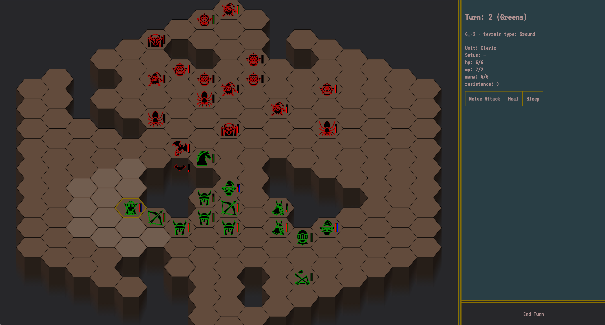

# Hexa Battle

a dungeon crawler written in TypeScript using React and svg





## To start locally

```
yarn
npm run start
```

## Browser Support

Only tested on the latest version of Chrome

## Credits

kudos to http://game-icons.net/ for providing awesome icons
